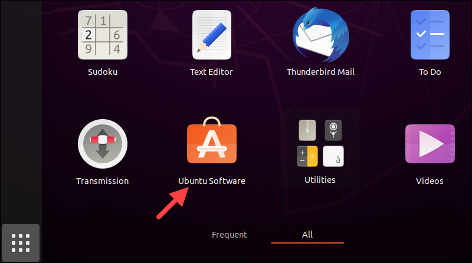
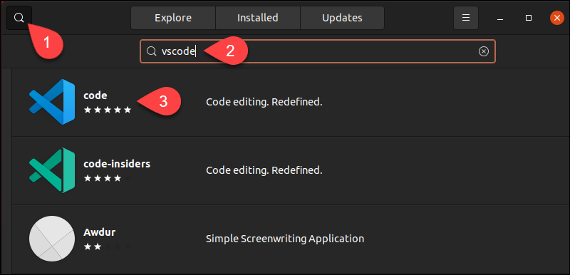
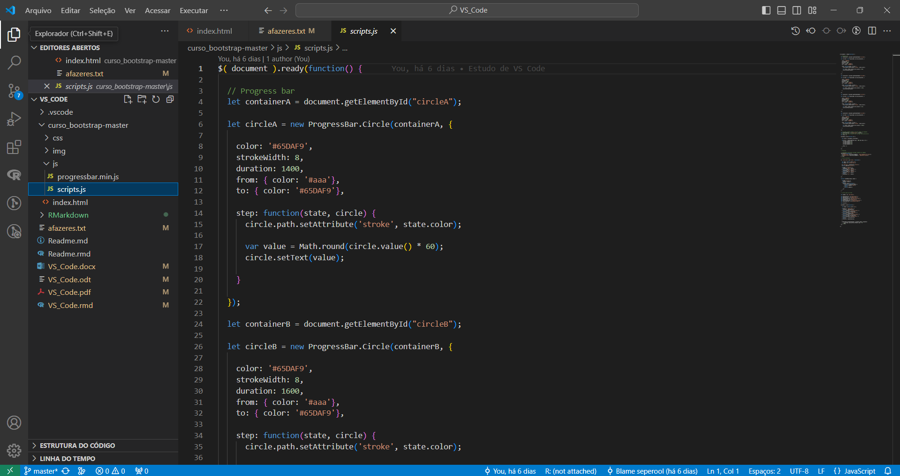
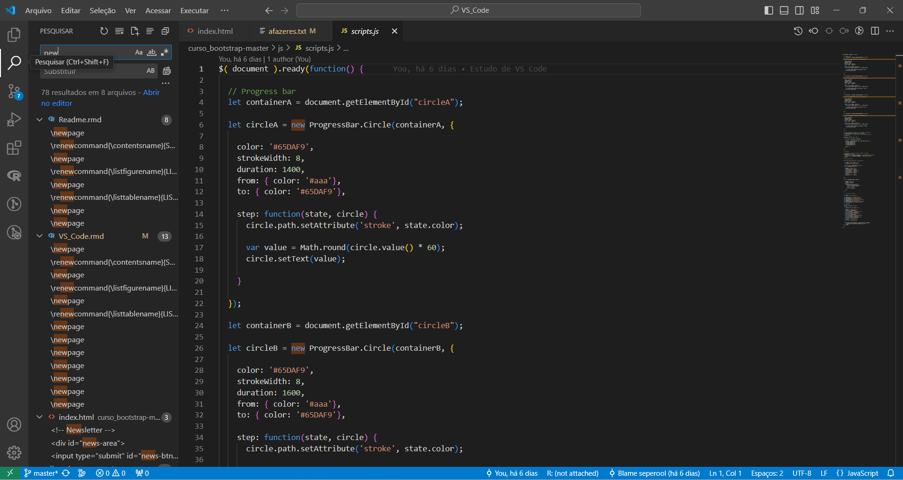
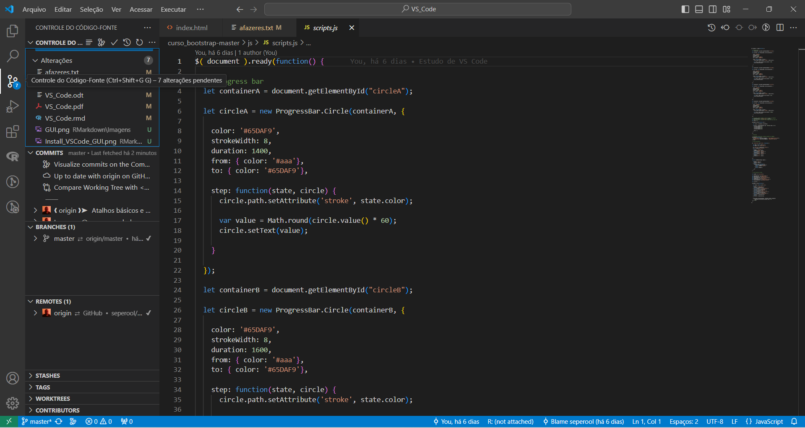
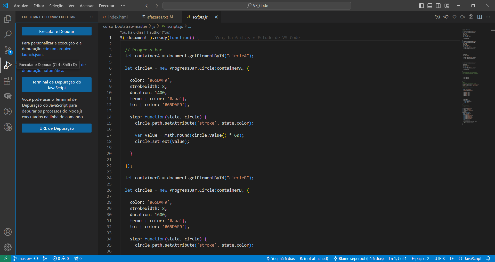
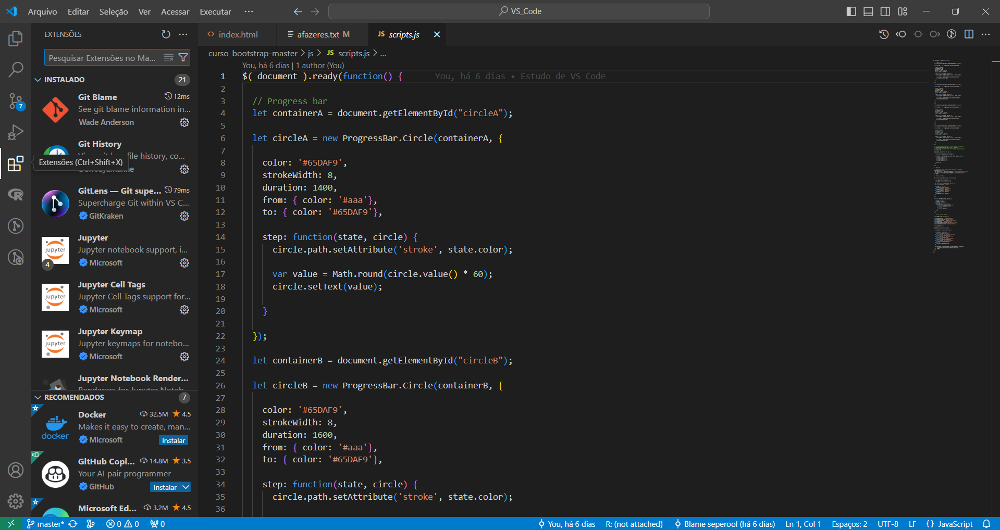
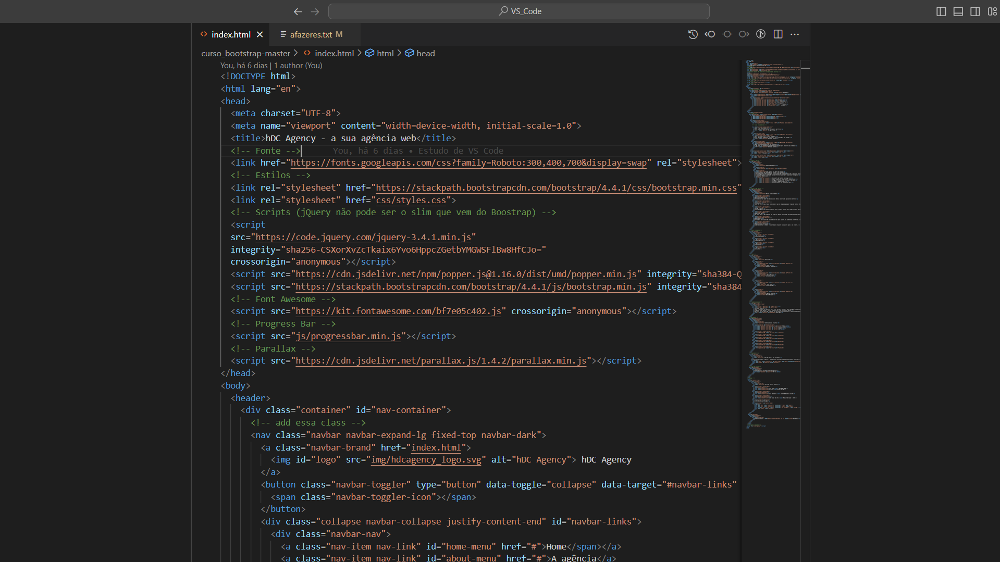

\thispagestyle{empty}

\newpage
\pagenumbering{roman}

```{=latex}
\setcounter{tocdepth}{4}
\renewcommand{\contentsname}{SUMÁRIO}
\tableofcontents
```

\newpage

```{=latex}
\setcounter{tocdepth}{4}
\renewcommand{\listfigurename}{LISTA DE FIGURAS}
\listoffigures
```

\newpage

```{=latex}
\setcounter{tocdepth}{4}
\renewcommand{\listtablename}{LISTA DE TABELAS}
\listoftables
```

```{r Pacotes, message=FALSE, warning=FALSE, echo=FALSE}
library(knitr)
library(rmarkdown)
library(readr)
library(tibble)
library(magrittr)
library(dplyr)
library(tidyr)
library(data.table)
library(janitor)
```

\newpage

# OBJETIVO

Estudo dirigido de Visual Studio Code.\

\pagenumbering{arabic}
\newpage

# INTRODUÇÃO

## Instalação

<https://code.visualstudio.com/download>

### Windows

- Baixar instalador pelo site:\
<https://code.visualstudio.com/download>

### Linux

#### snap

- Podemos instalar o VS Code pelo terminal, através do comando:\
`sudo snap install --classic code`\

#### apt

- Update repositório:\
`sudo apt update`\

- Instalando dependências do pacote:\
`sudo apt install software-properties-common apt-transport-https wget -y`

- Adicionando chave GPG:\
`wget -q https://packages.microsoft.com/keys/microsoft.asc -O- | sudo apt-key add -`

- Adicionando Repositório:\
```
sudo add-apt-repository "deb [arch=amd64] https://packages.microsoft.com/repos/vscode stable main"
```

- Instalando **VS Code**:\
`sudo apt install code`

\newpage

#### GUI

- Passo a passo:\

{width=60%}


{width=60%}


#### Instalador .tar.gz

- Baixar o instalador pelo site:\
<https://code.visualstudio.com/download>

- Instalar o arquivo `.tar.gz`.\

\newpage

## Conhecendo o **VS Code**

### Barra de navegação principal (barra superior)

- Arquivo:\
Controla ações relacionadas aos arquivos.\
  - Abrir arquivos em branco.\
  - Abrir arquivos.\
  - Abrir pastas.\
  - Arquivos recentes.\
  - Salvar.\
  - Salvar como.\
  - Salvar automático.\

- Editar:\
Recursos relacinados com a edição dos arquivos.\
  - Cortar.\
  - Copiar.\
  - Colar.\
  - Desfazer.\
  - Refazer.\
  - Localizar.\
  - Substituir.\

- Seleção:\
Opções de seleção de texto.\
  - Selecionar tudo.\
  - Expandir.\
  - Reduzir.\
  - Selecionar todas as ocorrências de determinada palavra.\

\newpage

- Ver:\
Altera a view (área util) do **VS Code**.\

- Acessar:\
Ir para algum lugar.\

- Executar:\
Rodar uma aplicação e um debug.\

- Terminal:\
Detalhar os terminais.\

- Ajuda:\
Informações e documentações sobre o editor **VS Code**.\

\newpage

### Activity bar

- Explorar:\
  - Ver a pasta/projeto que estamos trabalhando no momento.\
  - Navega pelos arquivos da pasta.\

{width=60%}


- Pesquisar:\
  - Pesquisa por determinadas palavras no código (todas as ocorrências).\
  - Podemos substituir determinadas palavros por outras também.\

{width=60%}


\newpage

- Controle de código-fonte/versionamento (**git**/**github**):\
  - Destinado ao controle de versionamento (como *add*, *commit*, *push*, *pull*, ...).\

{width=60%}


- Executar e apurar:\
  - Faz o debug (procurar e corrigir erros).\
  - Roda a aplicação.\

{width=60%}


\newpage

- Extensões:\
  - Procurar extensões.\
  - Baixar extensões.\

{width=60%}


\newpage

### Panels e status bar

- Side bar:\
  - Arquivos abertos.\
  - Árvore do projeto.\
  Todos os arquivos que compõem o projeto, ou estão na pasta do projeto.\

- Status bar (barra inferior):\
  - Informa a *branch* do controle de versionamento (*git*/*github*).\
  - Botão para sinconizar as alterações no projeto (controle de versionamento).\
  - Informações de erros no projeto (*debug*).\

- minimap (lateral direita):\
  - Resumo visual do código.\
  - Facilita a navegação pelo código.\

\newpage

# ATALHOS E CONFIGURAÇÕES ESSENCIAIS

## Esconder sidebar (barra lateral do projeto)

- Para esconder, ou exibir, a barra lateral do projeto, onde se encontra a navegação das pastas e arquivos do projeto, usamos:\
`Ctrl + b`\

## Abrir arquivos rápidamente

- Podemos usar o comando `Ctrl + p` para procurar e abrir o arquivo pelo nome, dentro da pasta em que estamos trabalhando.\

## Abrir o **VS Code** pelo terminal

- No terminal, podemos abrir determinada pasta de um projeto direto no **VS Code** usando o comando:\
`code .`\
É necessário esta na pasta para abri-la.\

## Abrir janela de erros via comando

- O atalho para abrir, ou ocultar, a janela de erro é:\
`Crtl + Shift + m`\

## Configurações do sistema **VS Code**

- O atalho para acessar as configurações do sistema do **VS Code** é:\
`Ctrl + ,`\

- Na configuração do sistema podemos alterar coisas como:\
  - Tamanho da fonte.\
  - Fonte.\
  - Definir arquivos excluídos do editor.\
  - ...\

\newpage

## Salvamento automático

- Para habilitar o salvamento automático:\
`Arquivo > Salvamento automático`\

## Baixando novas extensões

- É recomendado para ter um entendimento melhor sobre a extensão, abrir a pagina dela no marketplace do Visual Studio.\
<https://marketplace.visualstudio.com/>

- No marketplace do Visual Studio são fornecidos informações sobre a extensão, comentários de usuarios (perguntas e respostas) e o rating da extensão.\

## Baixando extensões recomendadas

- O VS Code lista na aba de extensões: 
  - Extensões baixadas no sistema.\
  - As principais extensões, mais bem avaliadas e baixadas do **VS Code**.\

- Outro recurso é as recomendações do **VS Code** para o usuário. Para acessar digitamos o comando na barra de procura por extensões:\
`@recommended`\
Então é listado recomendações de extensões do **VS Code** levando em consideração o perfil do usuário, baseado nos arquivos abertos recentemente pelo usuário.\

{width=60%}


\newpage

## Abrir terminal no **VS Code**

- Para abrir o terminal no **VS Code** usamos:\
`Ctrl + '`\

- Também podemos abrir vários terminais em paralelo, usando:\
`Ctrl + Shift + '`\

- Para fechar o terminal usamos o comando no terminal:\
`exit`\

## Ativando modo zen no **VS Code**

- Modo zen deixa apenas o código em tela cheia, eliminando outras distrações.\
`Ver > Aparência > Modo zen`\

{width=60%}